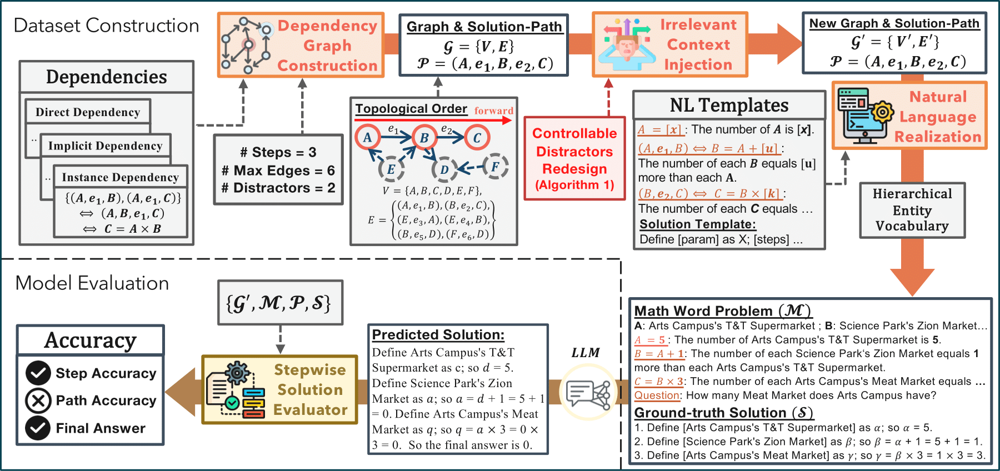
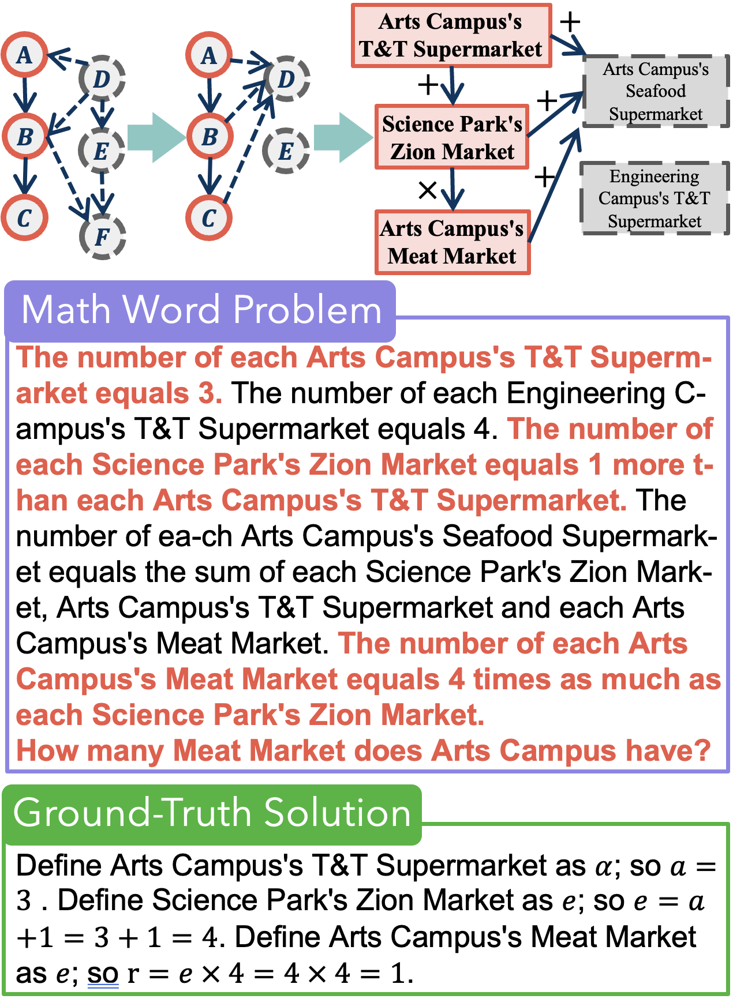
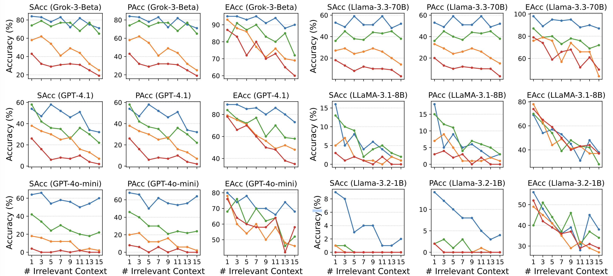
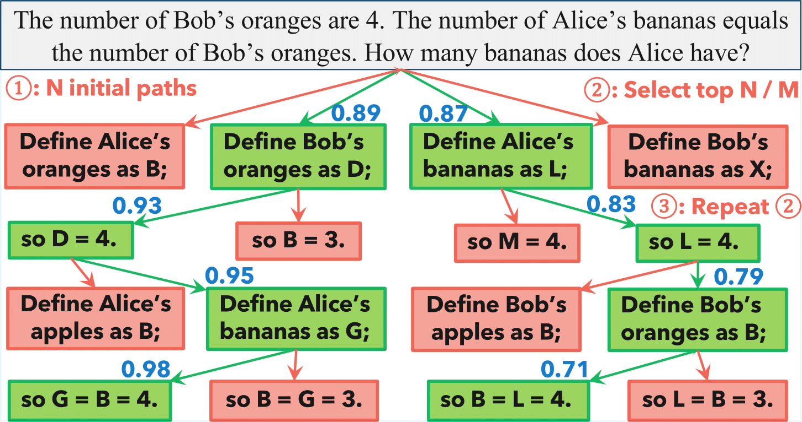

# GSM-DC
---
GSM-DC is synthetic data generator and evaluator, developed to study the reasoning robustness of LLMs under irrelevant context.
---



## Overview

This repository provides tools to:
- **Generate** symbolic math problems as dependency graphs (DAGs)
- **Inject** irrelevant context (IC) in a controlled manner
- **Render** problems into natural language using GSM8K-style templates
- **Evaluate** LLM responses at each reasoning step using a symbolic parser
- **Visualize** graphs and reasoning pipelines

Example usage: see `example_ic.ipynb`

---

## Dataset Structure and Pipeline

Each problem is represented as a tuple: (G', M, P, S)
- G': Augmented graph with distractors
- M: Natural language problem
- P: Reasoning path
- S: Ground-truth solution

---

## Problem and Graph

When calling `id_gen.gen_prob()`, a `Problem` instance is initialized:

- **Graph Class**: Manages DAG construction
- **Problem Class**: Adds parameters, values, entity names, and text rendering
- Graph stored as `id_gen.problem.G` using NumPy boolean matrices
- Nodes: tuples (i, j, k, l) with meanings:
  - RNG: (-1, 0, 0, 0)
  - Instance Parameter: (0, j, k, l)
  - Abstract Parameter: (1, j, k, l)
- Dependency graph: `id_gen.problem.template`, a `networkx.DiGraph`
- Value map: `id_gen.problem.lookup`
- Entity names: `id_gen.problem.N[i][j]`
- Drawing tools: `id_gen.problem.draw()`



---

## Benchmarking LLM Robustness

We systematically benchmark six models to study the impact of irrelevant context (IC) on multi-step reasoning tasks:
- **Closed-source models**: Grok-3-Beta, GPT-4.1, GPT-4o-mini
- **Open-source models**: LLaMA-3.3-70B, LLaMA-3.1-8B, LLaMA-3.2-1B

Each model is evaluated using a five-shot prompting strategy, enhanced with a structured `Background` section that highlights necessary dependencies.

We vary the number of injected irrelevant nodes (\(m = 1 	ext{–} 15\)) across four reasoning depths (\(rs = 2, 3, 4, 5\)) and compute:
- **Step Accuracy (SAcc)**: Are all reasoning steps correct?
- **Path Accuracy (PAcc)**: Is the full reasoning path valid?
- **Extraction Accuracy (EAcc)**: Is the final answer correct?

Each point is averaged over 100 generated problems per configuration.

---



*Figure: Step accuracy of six LLMs under increasing irrelevant context. Left: Grok-3-Beta, GPT-4.1, GPT-4o-mini (closed-source models); Right: LLaMA-3.3-70B, LLaMA-3.1-8B, LLaMA-3.2-1B (open-source models). Each curve represents a reasoning depth \(rs \in \{2, 3, 4, 5\}\).*

---

## Training the Process Reward Model (PRM)

The PRM is trained on a dataset labeled by `true_correct()` in `tools/irr_tools_test.py`. To create this dataset:
- Run `generate_dataset.py`
- For each generated problem:
  - Model generates stepwise CoT output
  - Each step is scored: steps after the first mistake are labeled as incorrect

Use `prm_train.py` to train the PRM using this dataset.

---

## Tree-of-Thoughts (ToT) Search with PRM

During evaluation, we use a PRM-guided Tree-of-Thought search (`prm_tree.py`).

- `N`: Initial number of root paths
- `M`: Beam width per path
- `K = N / M`: Top-K continuations explored per step

This guided search improves robustness, especially under high IC.



---

## Benchmarking LLM Robustness

We benchmarked six LLMs:
- **Closed models**: Grok-3-Beta, GPT-4.1, GPT-4o-mini
- **Open models**: LLaMA-3.3-70B, LLaMA-3.1-8B, LLaMA-3.2-1B

Prompting strategy:
- 5-shot examples
- Structured Background section that outlines key quantities and dependencies

Metrics:
- **SAcc**: Step Accuracy
- **PAcc**: Path Accuracy
- **EAcc**: Extraction Accuracy

---

## Evaluation Pipeline

To test your own LLM using the GSM-DC dataset:
- Run `test_batch_saved.py`
- Set `MODEL_PATH` and `DATASET_PATH` to your HuggingFace repo or checkpoint (Relase after paper submission and review)
- Optionally enable tree search and PRM reranking

---

## Acknowledgements

This project is inspired by and builds upon:
- [GSM8K](https://github.com/openai/grade-school-math) by OpenAI
- [iGSM](https://github.com/facebookresearch/iGSM) by Facebook Research
- [PRM](https://github.com/sdiehl/prm) by Stephen Diehl

---

## Citation

```bibtex
@article{gsm-dc2025,
  title={How Is LLM Reasoning Distracted by Irrelevant Context? An Analysis Using a Controlled Benchmark},
  author={Anonymous},
  journal={EMNLP},
  year={2025}
}
```
